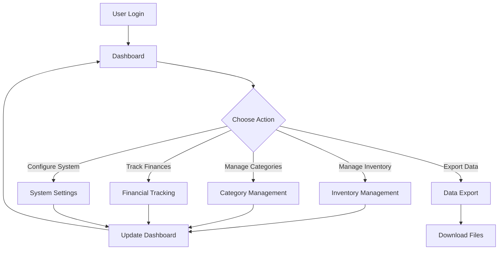

# ItemHive

A inventory management system provides comprehensive inventory tracking, financial management, and dynamic category management.

## Features

### Inventory Management

- **CRUD Operations**: Add, edit, remove, and view inventory items
- **Item Tracking**: Track item name, category, quantity, and price
- **Dynamic Categories**: Create and remove custom categories on the fly
- **Search & Filter**: Search items by name and filter by category
- **Low Stock Alerts**: Automatic alerts when items fall below threshold

### Financial Tracking

- **Income & Expenses**: Track money earned and spent
- **Net Profit Calculation**: Automatic calculation of net profit
- **Transaction Management**: Add, view, and delete financial transactions
- **Toggle Feature**: Enable/disable financial tracking via settings
- **Price Management**: Adjust item prices and apply discounts

### Dashboard

- **Real-time Statistics**: Total items, categories, low stock alerts
- **Financial Summary**: Income, expenses, and net profit overview
- **Interactive Charts**:
  - **Pie Chart**: Category distribution
  - **Line Chart**: Revenue trends over time
  - **Bar Chart**: Sales overview
- **Real-time Updates**: Dashboard updates automatically when data changes

### Configuration & Settings

- **Feature Toggles**: Enable/disable features (e.g., financial tracking)
- **Low Stock Threshold**: Configure when low stock alerts trigger
- **Data Export**: Export inventory and financial data to CSV or JSON

### User Interface

- **Responsive Design**: Works on desktop, tablet, and mobile devices
- **Clean UI**: Modern, intuitive interface built with Tailwind CSS
- **Forms**: Easy-to-use forms for adding/editing items and categories
- **Modal Dialogs**: Smooth modal interactions for data entry

### Data Storage

- **MongoDB Database**: NoSQL database for flexible data storage
- **Mongoose ODM**: Object Data Modeling for MongoDB with TypeScript
- **Persistent Storage**: All data is saved to the database

## System Overview

## Quick Start

1. Clone the repository
2. Install dependencies: `npm install`
3. Set up your MongoDB database
4. Configure environment variables
5. Seed the database: `npm run db:seed`
6. Start development: `npm run dev`

For detailed setup instructions, see [CONTRIBUTING.md](CONTRIBUTING.md).

## Screenshots

_Coming soon - Screenshots of the dashboard, inventory management, and other key features will be added here._

## Contributing

We welcome contributions! Please see [CONTRIBUTING.md](CONTRIBUTING.md) for:

- Development setup instructions
- Technical documentation
- API endpoints
- Database schema
- Project structure
- Contribution guidelines

## Future Enhancements

- [ ] Full authentication with NextAuth.js
- [ ] Multi-user support with role-based access
- [ ] Barcode scanning
- [ ] Inventory reports
- [ ] Email notifications for low stock
- [ ] Advanced analytics
- [ ] Bulk import/export
- [ ] Inventory history/audit log

## License

This project is open source and available for use.

## Support

For issues or questions, please check the [CONTRIBUTING.md](CONTRIBUTING.md) guide or create an issue in the repository.

---

**ItemHive** - Built with Next.js and TypeScript
